# CI/CD Pipeline for Hostel Mess Management System

## College of Science and Technology

Rinchending, Bhutan

---

## DSO101 - Continuous Integration and Continuous Deployment

Final Project Report

**CI/CD Pipeline for Hostel Mess Management System**

| Module    | DSO101 - CI/CD             |
| --------- | -------------------------- |
| Programme | BE in Software Engineering |
| Group     | Group 7                    |
| Date      | May 2026                   |

### Team Members

- Pelden Nidup
- Kinley Pem
- Tshering Tenzin
- Yeshi Lhendrup
- Sonam Wangmo

**Tutor:** Mr. Ashish Chhetri

### Project Links

- **GitHub Repository:** https://github.com/kinleyp06/WEB_FinalProject_Group7
- **Frontend URL:** https://hostel-mess-frontend.onrender.com
- **Backend URL:** https://hostel-mess-backend-1fq4.onrender.com

---

# Introduction

The Hostel Mess Management System is a full-stack web application designed for the College of Science and Technology. It allows students to view meal plans, submit feedback, make suggestions, vote in polls, and view announcements. Administrators manage meal plans, announcements, finance records, and respond to student feedback.

This report covers the DevOps implementation of containerising the application using Docker and automating deployment through a GitHub Actions CI/CD pipeline. The backend is deployed on Render, the frontend on Render, and the database on Neon (cloud PostgreSQL).

---

# Aim and Objectives

The aim is to implement a complete CI/CD pipeline for the Hostel Mess Management System so that every code change is automatically tested, built, and deployed to production without manual steps.

## Objectives

- Containerise the backend and frontend using Docker with Alpine base images
- Implement a GitHub Actions workflow that triggers on every push to main
- Automate deployment to Render for both backend and frontend services
- Manage all credentials securely using GitHub Secrets and environment variables
- Integrate with Neon cloud PostgreSQL as the external database service

---

# Feasibility

All tools used are free and well documented. GitHub Actions is built into the existing GitHub repository with no extra setup needed. Render offers a free tier for web services sufficient for the project scale. Neon provides a free serverless PostgreSQL instance. The team had prior exposure to these tools through DSO101 practicals.

---

# Expected Outcome

| Deliverable                | Acceptance Criteria                                       |
| -------------------------- | --------------------------------------------------------- |
| Backend Dockerfile         | Builds successfully, container runs on port 5000          |
| Frontend Dockerfile        | Builds successfully, Next.js served on port 3000          |
| GitHub Actions Workflow    | Green checkmark on every push to main branch              |
| Render Backend Deployment  | Backend live and accessible via public URL                |
| Render Frontend Deployment | Frontend live and accessible via public URL               |
| Neon Database              | PostgreSQL tables migrated and accessible from backend    |
| GitHub Secrets             | All credentials stored as secrets, none hardcoded in code |

---

# Implementation Overview

## GitHub Actions Workflow

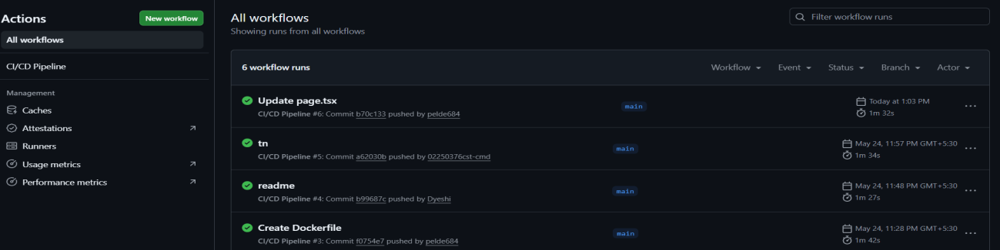

## Render Backend Deployment

## Render Frontend Deployment

## GitHub Secrets

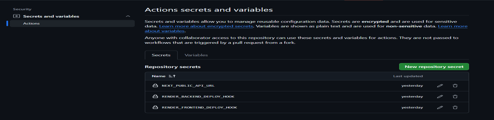

---

# Work Plan

| Task                              | Member          | Week       |
| --------------------------------- | --------------- | ---------- |
| Backend Dockerfile                | Kinley Pem      | Week 10    |
| Frontend Dockerfile               | Kinley Pem      | Week 10    |
| GitHub Actions workflow setup     | Tshering Tenzin | Week 11    |
| Render backend deployment         | Pelden Nidup    | Week 12    |
| Render frontend deployment        | Pelden Nidup    | Week 12    |
| Neon database setup and migration | Sonam Wangmo    | Week 12    |
| GitHub Secrets configuration      | Yeshi Lhendrup  | Week 12    |
| Testing and debugging pipeline    | All             | Week 13    |
| Documentation                     | All             | Week 14-15 |

---

# Implementation Review

## Docker Configuration & Optimization

### Backend Dockerfile

A single-stage build is used with a lightweight Alpine base image. The Prisma client is generated during the build step and only production-relevant files are copied.

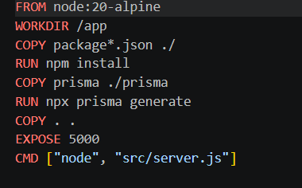

### Frontend Dockerfile

The frontend uses Next.js and is served as a Node.js server process. The Dockerfile installs dependencies, accepts the API URL as a build argument, builds the Next.js application, and starts the production server.

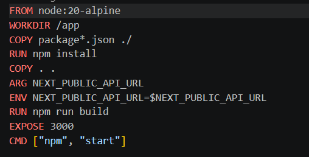

---

# CI/CD Pipeline Design

GitHub Actions was chosen because it is built into the GitHub repository and requires no additional setup.

| Stage            | Description                                                     |
| ---------------- | --------------------------------------------------------------- |
| Backend CI       | Checks out code, installs dependencies, generates Prisma client |
| Frontend CI      | Builds Next.js application                                      |
| Docker Build     | Builds backend and frontend Docker images                       |
| Deploy to Render | Triggers deploy hooks for backend and frontend                  |

## Backend CI

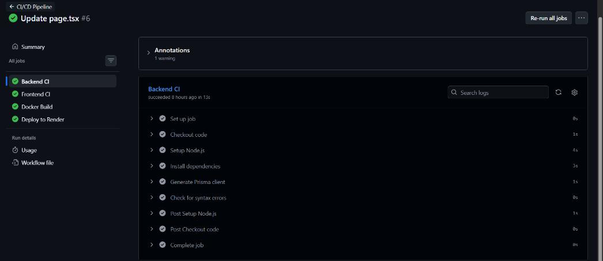

## Frontend CI

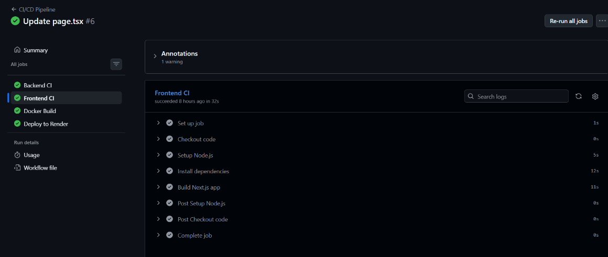

## Docker Build

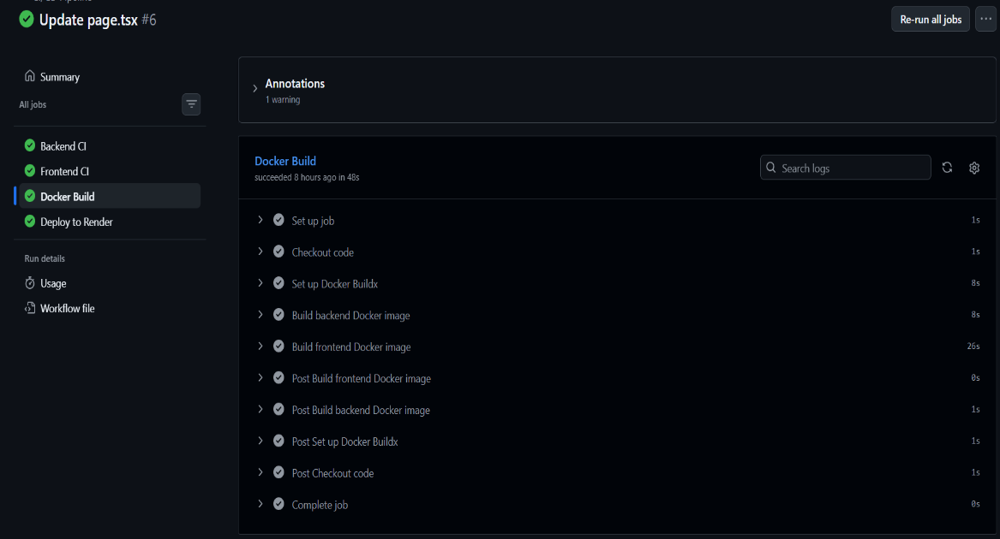

## Deploy to Render

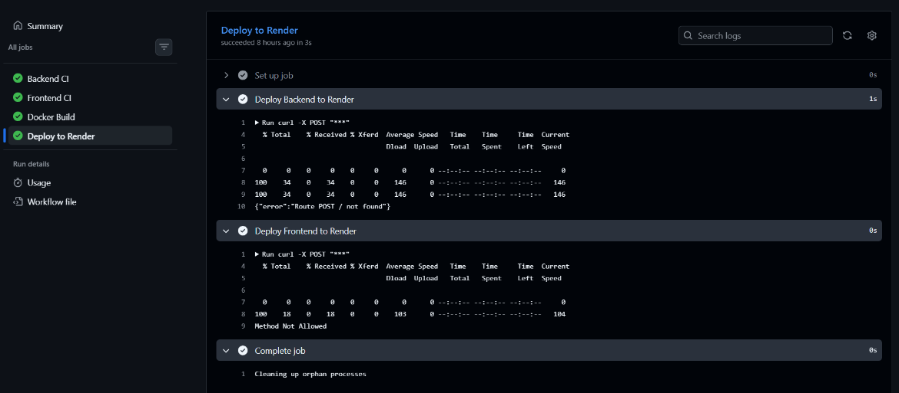

---

# Pipeline Implementation

The GitHub Actions workflow file is located at `.github/workflows/ci-cd.yml`

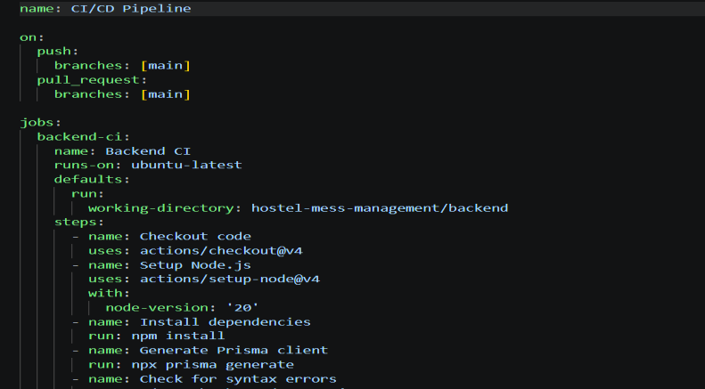

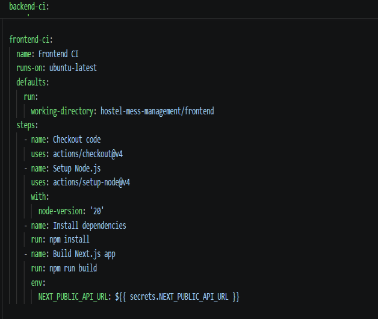

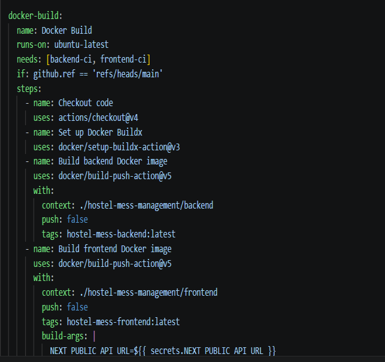

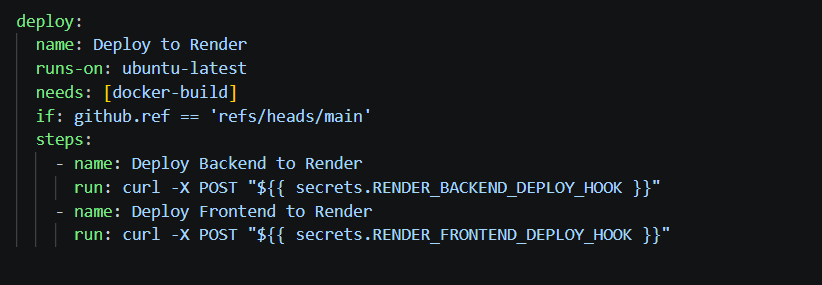

---

# Integration with External Services

## Render (Backend)

| Setting       | Value                                                |
| ------------- | ---------------------------------------------------- |
| Build Command | npm install && npx prisma generate                   |
| Start Command | npm start                                            |
| Auto Deploy   | On every push to main via GitHub Actions deploy hook |

### Build Command

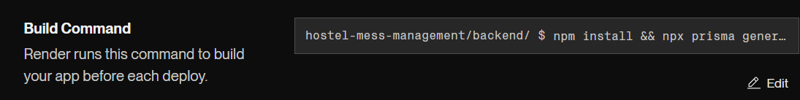

### Start Command

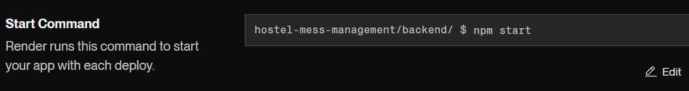

### Auto Deploy

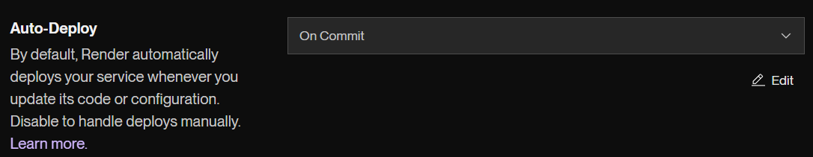

### Environment Variables

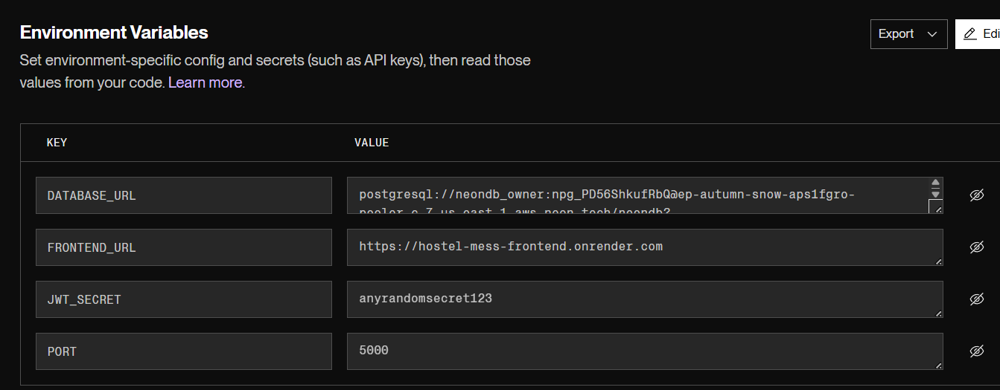

---

## Render (Frontend)

| Setting              | Value                                                |
| -------------------- | ---------------------------------------------------- |
| Build Command        | npm install && npm run build                         |
| Start Command        | npm start                                            |
| Auto Deploy          | On every push to main via GitHub Actions deploy hook |
| Environment Variable | NEXT_PUBLIC_API_URL                                  |
| Live URL             | https://hostel-mess-frontend.onrender.com            |

### Build Command

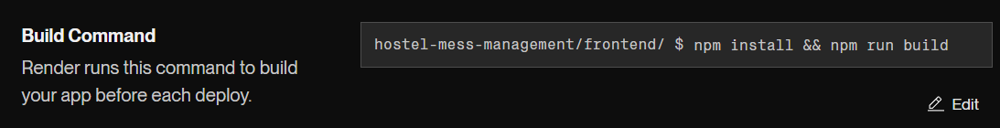

### Start Command

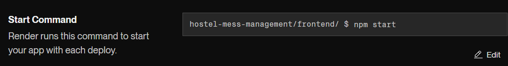

### Auto Deploy

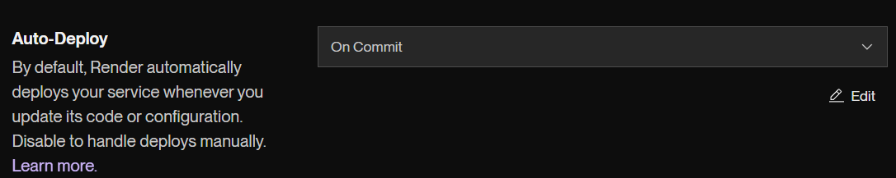

### Environment Variables

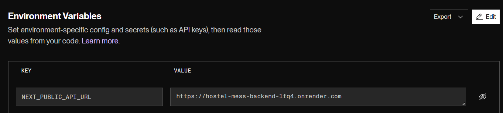

---

# Neon PostgreSQL Database

| Setting    | Value                        |
| ---------- | ---------------------------- |
| Provider   | Neon serverless PostgreSQL   |
| ORM        | Prisma 5.22                  |
| Connection | Pooled connection            |
| Migrations | 4 migrations applied         |
| Security   | Environment variable storage |

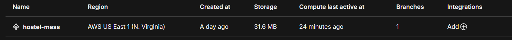

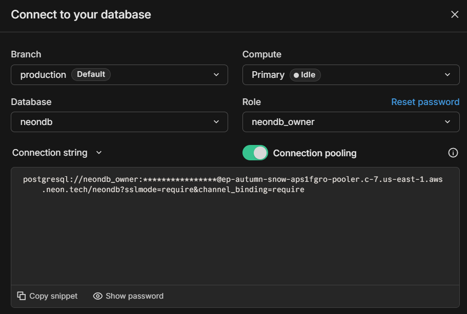

---

# Security Considerations

## Backend Variables

| Variable     | Purpose                      |
| ------------ | ---------------------------- |
| DATABASE_URL | PostgreSQL connection        |
| JWT_SECRET   | Authentication token signing |
| PORT         | Express server port          |
| FRONTEND_URL | Allowed frontend URL         |

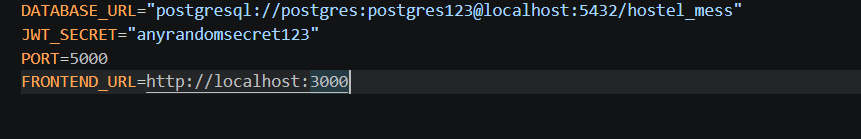

---

## Frontend Variables

| Variable            | Purpose         |
| ------------------- | --------------- |
| NEXT_PUBLIC_API_URL | Backend API URL |

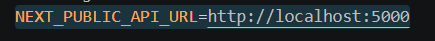

---

## GitHub Secrets

| Secret                      | Purpose           |
| --------------------------- | ----------------- |
| NEXT_PUBLIC_API_URL         | Backend API URL   |
| RENDER_BACKEND_DEPLOY_HOOK  | Backend redeploy  |
| RENDER_FRONTEND_DEPLOY_HOOK | Frontend redeploy |

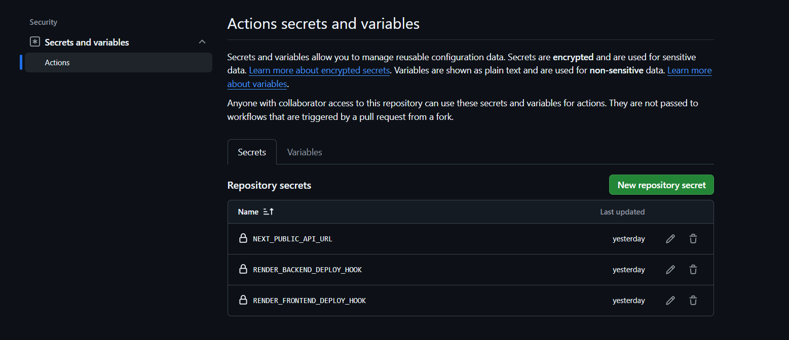

---

## Other Security Measures

- .env and .env.local excluded using .gitignore
- Passwords hashed using bcryptjs
- JWT tokens expire after 7 days
- Role-based access control
- CORS restrictions enabled
- HTTPS enabled by Render

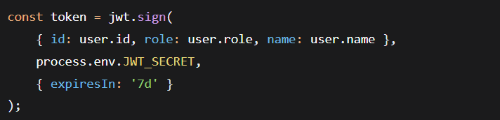

## Frontend Interceptor

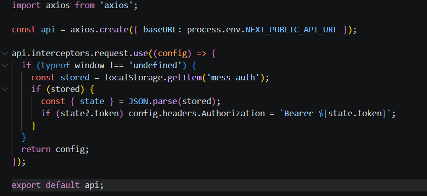

## Backend Docker Security

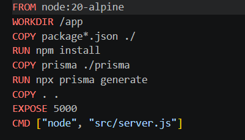

## Frontend Docker Security

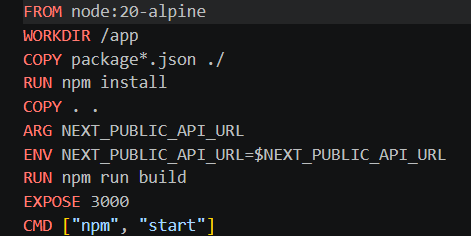

---

# Challenges and Solutions

| Challenge                     | Solution                       |
| ----------------------------- | ------------------------------ |
| DATABASE_URL issue            | Corrected variable naming      |
| Large repository size         | Removed node_modules and .next |
| Render cold starts            | Added frontend loading state   |
| Neon local connection issue   | Used direct connection locally |
| GitHub Actions not triggering | Recreated ci-cd.yml            |
| CORS issues                   | Configured exact FRONTEND_URL  |

---

# Conclusion

This project successfully implemented a CI/CD pipeline for the Hostel Mess Management System. Docker containerisation, GitHub Actions automation, Render deployment, and Neon PostgreSQL integration were completed successfully.

The application automatically builds, tests, and deploys whenever code is pushed to the main branch.

---

# References

- https://docs.docker.com
- https://docs.github.com/actions
- https://render.com/docs
- https://neon.tech/docs
- https://www.prisma.io/docs
- https://nextjs.org/docs
